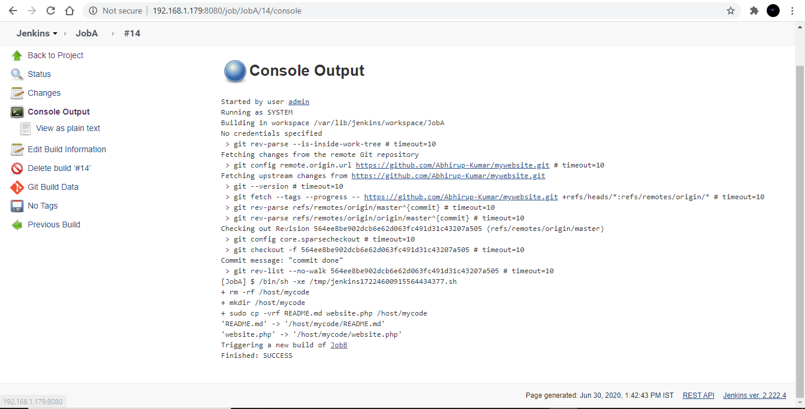
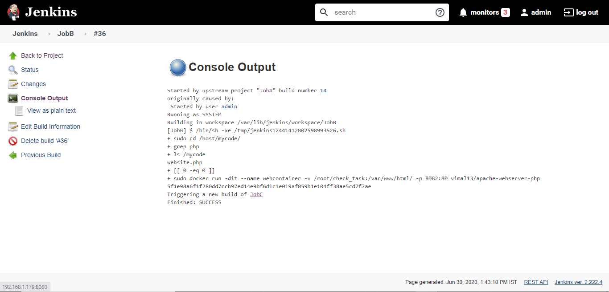

# Pipeline
A pipeline in a Software Engineering team is a set of automated processes that allow Developers and DevOps professionals to reliably and efficiently compile, build and deploy their code to their production compute platforms. There is no hard and fast rule stating what a pipeline should like like and the tools it must utilise, however the most common components of a pipeline are; build automation/continuous integration, test automation, and deployment automation.

A pipeline generally consists of a set of tools which are normally broken down into the following categories;

1.Source Control
2.Build tools
3.Containerisation
4.Configuration Management
5.Monitoring

# Project Explanation
In this project we are going to first make a Jenkins images using Docker file. For that our base O.S. will be centos and we are going to configure it according to our needs to start a Jenkins server on it completely.
We are downloading the Jenkins rpm from online repository and the Open JDK to run Jenkins on top of that. We  than build our image using this docker file into a full-fledged Jenkins server ready to run.
After that we are making 5 Jobs in total in Jenkins to complete our goal. Our goal is to deploy our application on webserver as soon as the developer commits the code. Depending upon the code suitable server will be launched automatically. Event the testing part will  be done by Jenkins only. It will look for 200 code on our webserver so that if any problem is noticed automatically developer will be updated with the same so that error can be corrected. We are also making a job for monitoring purposes only so our launched website never goes down and if it does again new container will be launched with it also.

## Docker File
We have used the Docker file to build our Jenkins image . 

The following is the code of our docker file used.

## JOB1(Github)

As soon as developer pushes the code on GitHub this job will pull the code from the GitHub which is our cloud SCM and download the code to local repository to be used by container to deploy on our website.

## JOB2(Container up)
This job will launch the suitable container depending upon which type of  code is uploaded by developer. If PHP code is committed ,server which support PHP application will be launched along with the code committed by developer. It also supports HTML format . It is all automated in Job to launch which docker container with the suitable image along with it. 
By looking at the code or program file, Jenkins should automatically start the respective language interpreter install image container to deploy code.

 ## JOB3(Monitoring the website)
 This job will test our application launched so that it is working accordingly to our desire. It will make sure so that running website is good in health and continuously accessed by our clients also. It will trigger the Job4 if any  error is there on our website.
 

## JOB4(Notify the Developer)
This job will sent the developer with the error message if the website fails to deploy or any error come up. We have used here the telegram bot so that if any problem is there with our website it will notify our developer as soon as possible. Developer can accordingly change the code and our website will be up and running .

## JOB5(Monitoring the containers)
This job will keep an eye on our container . If due to any reason it fails to deploy or stopped running it will again deploy our website in server on top of container .It helps in monitoring the containers health so that no problem occurs with it and if something happens it will again launch the docker container.

## Website

